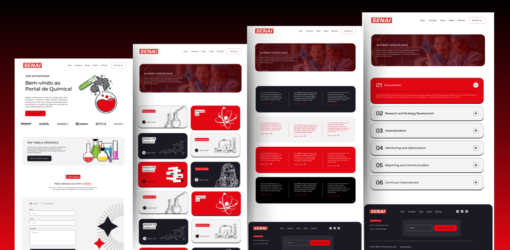

<div align="center">

</div>

</br>

<h1> PORTAL DE QUIMICA </h1>


<p align="center">
  <a href="">
    
  </a>
</p>

## Experimente o Portal de Química 🌟

Confira uma prévia do site abaixo:

🔗 **Acesse o Preview Interativo**[👉 Preview](https://portal-de-materias.vercel.app/preview.html)

🔗 **Acesse o site completo clicando aqui**   [👉 Portal de Química](https://portal-de-materias.vercel.app/)


## Sobre o Projeto 📂

O Portal de Matérias - Química é um mini-site focado na disciplina de Química, parte de um portal maior que reúne conteúdos educativos para estudantes do Ensino Médio. O objetivo é oferecer recursos interativos e acessíveis, promovendo o aprendizado e ajudando os alunos a se prepararem para vestibulares e carreiras.

## Objetivos 📌

- Criar um portal online acessível e educativo para alunos do Ensino Médio.

- Desenvolver conteúdos ricos e interativos que estimulem o aprendizado de Química.

- Fornecer informações relevantes sobre carreiras, estágios e vestibulares.

## Público Alvo 👨‍👩‍👧‍👦

- **Estudantes do Ensino Médio**: Alunos que estão cursando o ensino médio e precisam de recursos adicionais para estudar Química.
- **Vestibulandos**: Estudantes que estão se preparando para vestibulares e exames de admissão em universidades, que necessitam de materiais de estudo e simulados específicos de Química.
- **Professores de Química**: Educadores que buscam recursos didáticos e materiais de apoio para enriquecer suas aulas e ajudar seus alunos a compreender melhor os conceitos de Química.
- **Pais e Responsáveis**: Pais que desejam apoiar seus filhos nos estudos, fornecendo acesso a materiais educativos de qualidade.
- **Curiosos e Entusiastas da Química**: Pessoas interessadas em aprender mais sobre Química, seja por hobby ou por interesse pessoal.

## Tecnologias Utilizadas 🛠 💻

- HTML, CSS e JavaScript

### **Estruturação e estilização do site 🛠** </br>
  <a href="https://www.w3schools.com/css/" target="_blank" rel="noreferrer"> 
  </a>
  <a href="https://www.w3.org/html/" target="_blank" rel="noreferrer"> 
  </a>

### **Funcionalidades interativas 💻** </br>
<a href="https://developer.mozilla.org/en-US/docs/Web/JavaScript" target="_blank" rel="noreferrer"> 
  </a>

## Equipe 🏋️‍♀️

Conheça os membros da equipe responsáveis pelo desenvolvimento do Portal de Matérias,
dedicados a transformar o aprendizado em uma experiência mais acessível e envolvente. Cada integrante trouxe sua expertise e dedicação para garantir o sucesso do projeto, desde a organização até o desenvolvimento técnico. 

<a href="">

</a>

## Equipe ✨

<table>
    <tr>
        <td align="center" width="20%">
            <a href="https://www.linkedin.com/in/samuelbrag4/">
                
                <br /><b>Samuel Braga</b>
            </a>
            <br />
        </td>
        <td align="center" width="20%">
            <a href="https://www.linkedin.com/in/mariana-cardoso-507bba244/">
                
                <br /><b>Mariana Cardoso</b>
            </a>
            <br />
            <sub></sub>
        </td>
        <td align="center" width="20%">
            <a href="https://www.linkedin.com/in/vitor-sampaio-152839241/">
                
                <br /><b>Vitor Sampaio</b>
            </a>
            <br />
            <sub></sub>
        </td>
    </tr>
    <tr>
        <td align="center" width="20%">
            <a href="https://www.linkedin.com/in/maria-eduarda-reis-pereira-0756542b1/">
                
                <br /><b>Maria Eduarda Reis</b>
            </a>
            <br />
        </td>
        <td align="center" width="20%">
            <a href="https://www.linkedin.com/in/bruno-quintino-2268b932b/">
                
                <br /><b>Bruno Quintino</b>
            </a>
            <br />
            <sub></sub>
        </td>
    </tr>
</table>

## Funções 📝

- **Samuel Braga:** P.O., UX/UI Designer, Desenvolvedor, Identidade Visual, Testes
- **Mariana Cardoso:** Scrum Master, Desenvolvedora, Documentação, Gerenciamento, Design, Identidade Visual;
- **Vitor Sampaio:** Desenvolvedor, Design, Testes;
- **Maria Eduarda Reis:** Desenvolvedora, Design, Identidade Visual;
- **Bruno Quintino:** Desenvolvedor, Conteúdos, Testes

## Estrutura de Pastas 💼

```markdown
📦 PortaldeMaterias
┣ 📂 assets
┃ ┣ 📂 css
┃ ┣ 📂 img
┣ 📂 pages
┃ ┣ 📂 noticia
┃ ┣ 📂 simulados
┃ ┣ 📜 carreiras.html
┃ ┣ 📜 dica.html
┃ ┣ 📜 noticia.html
┃ ┣ 📜 simulado.html
┃ ┗ 📜 sobre.html
┣ 📜 [index.html](http://_vscodecontentref_/0)
┗ 📜 [README.md](http://_vscodecontentref_/1)
```

## Contribuindo com o nosso **Projeto**!💪

Se você deseja contribuir com o **Portal de Química**, siga os passos abaixo: 

1. Faça um fork do repositório. 🔧
   - Isso cria uma cópia do repositório no seu próprio GitHub.
   - Exemplo: Clique no botão "Fork" no canto superior direito da página do repositório.

2. Clone o repositório forkado para o seu computador. 💻
   - `git clone https://github.com/seu-usuario/nome-do-repositorio.git`
   - Exemplo: `git clone https://github.com/joao/projeto-exemplo.git`

3. Crie uma nova branch para a sua feature. 🎞
   - `git checkout -b feature/nova-feature`
   - Isso cria e muda para uma nova branch chamada `feature/nova-feature`.
   - Exemplo: `git checkout -b feature/adiciona-nova-funcionalidade`

4. Faça commit das suas alterações. 📦
   - `git commit -am 'Adiciona nova feature'`
   - Isso adiciona todas as mudanças e cria um commit com a mensagem `'Adiciona nova feature'`.
   - Exemplo: `git commit -am 'Corrige bug na função de login'`

5. Faça push para a branch. 🏃‍♂️
   - `git push origin feature/nova-feature`
   - Isso envia suas alterações para o repositório remoto na branch `feature/nova-feature`.
   - Exemplo: `git push origin feature/adiciona-nova-funcionalidade`

6. Abra um Pull Request. 💽
   - Vá até o repositório original no GitHub e clique no botão "New Pull Request".
   - Selecione a branch que você criou e envie o Pull Request para revisão.

### Explicação dos comandos Git: 👩‍💻👨‍💻

- `git clone <url>`: Clona o repositório especificado pela URL para o seu computador.
- `git checkout -b <nome-da-branch>`: Cria uma nova branch com o nome especificado e muda para essa branch.
- `git commit -am '<mensagem>'`: Adiciona todas as mudanças no diretório de trabalho ao índice (staging area) e cria um commit com a mensagem especificada.
- `git push origin <nome-da-branch>`: Envia as mudanças da branch especificada para o repositório remoto.

Seguindo esses passos, você poderá contribuir com o projeto de forma organizada e eficiente. Agradecemos suas contribuições!


## Nossos Agradecimentos ❤

Agradecemos a todos que contribuíram para a realização deste projeto, seja com código, sugestões ou feedback. Sua ajuda foi essencial para o desenvolvimento do **Portal de Química**.
